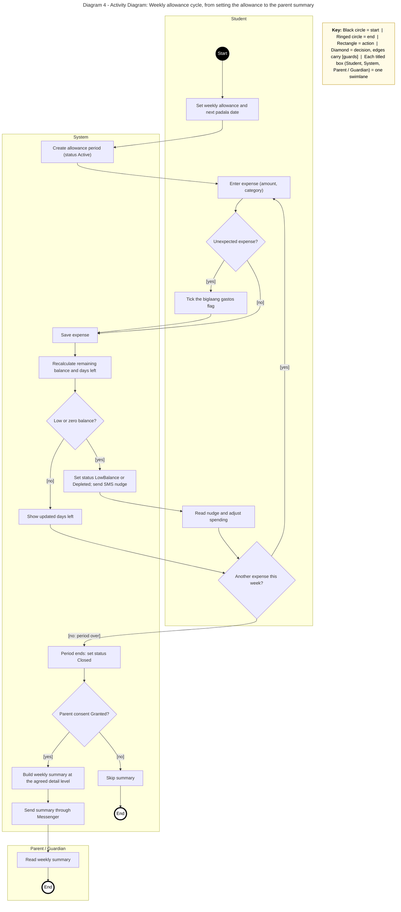

# Diagram 4: Activity

**Core workflow:** the weekly allowance cycle, from setting the allowance to the parent summary. Lanes: Student, System, Parent / Guardian.

**Primary audience:** Team and testers

**Risk it reduces:** Gaps in the workflow, e.g. what happens when the parent has not given consent.

**Owner / reviewer (proposed):** Joram H. Hona / Clarence B. Ginete
