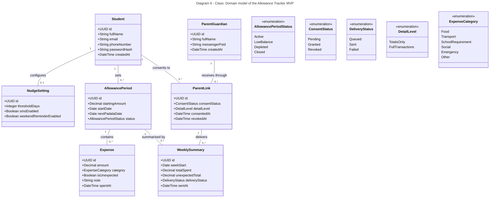

# Diagram 6: Class

**Status fields and enumerations:** `AllowancePeriod.status` uses `AllowancePeriodStatus`; `ParentLink.consentStatus` uses `ConsentStatus`; `WeeklySummary.deliveryStatus` uses `DeliveryStatus`. Attribute types name their enumerations.

**Primary audience:** Developers

**Risk it reduces:** Inconsistent domain vocabulary and missing status enumerations.

**Owner / reviewer (proposed):** Clarence B. Ginete / Shamel O. Rebusora
