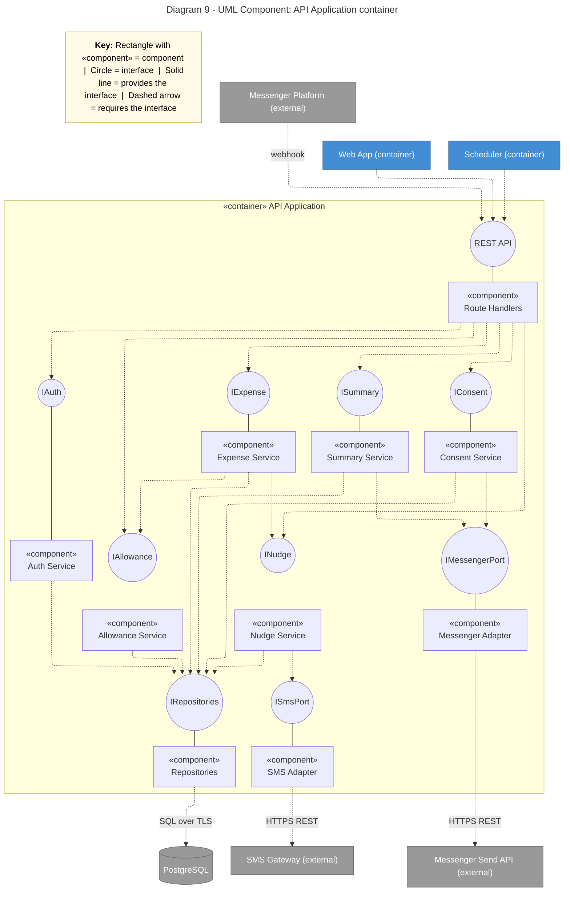

# Diagram 9: UML component

**Interfaces:** every external service (SMS Gateway, Messenger Send API) sits behind a port interface (`ISmsPort`, `IMessengerPort`) implemented by an adapter; services never call the vendors directly.

**Primary audience:** Back-end developers

**Risk it reduces:** Direct coupling to SMS, Messenger, or the database that is hard to replace or test.

**Owner / reviewer (proposed):** Reese Goyal / Joram H. Hona
