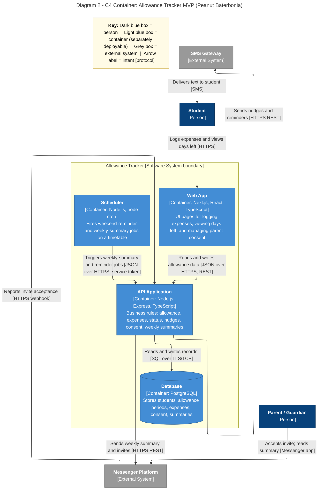

# Diagram 2: C4 Container

**Next.js decision:** we drew the Next.js app as **one** container (UI only); the business rules live in the separate API Application container.

**Primary audience:** Developers and whoever deploys the system

**Risk it reduces:** Choosing the wrong technology split or leaving a protocol undefined.

**Owner / reviewer (proposed):** Erica G. Llena / Shamel O. Rebusora
