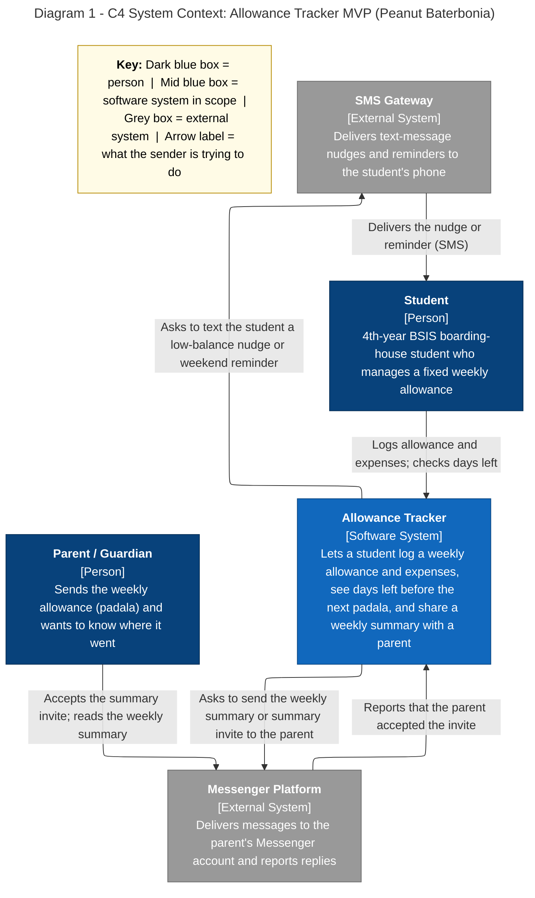

# Diagram 1: C4 System Context

**System description:** the Allowance Tracker is drawn as one box; every arrow states what the sender is trying to do.

**Primary audience:** Instructor, team, and non-technical partners (e.g. parents)

**Risk it reduces:** A missed user role or external system, so an integration surprises us late.

**Owner / reviewer (proposed):** Erica G. Llena / Joram H. Hona
