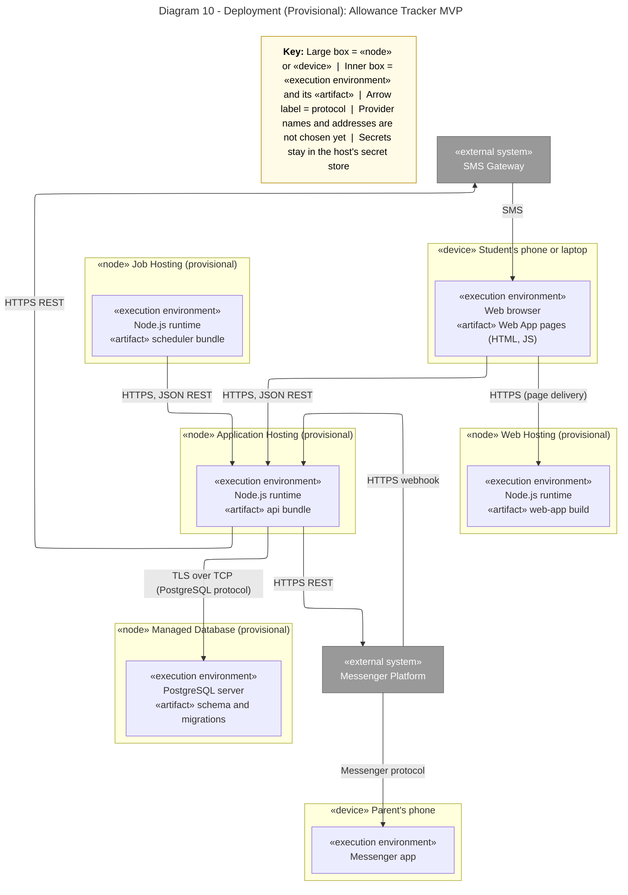

# Diagram 10: Deployment

**Provisional:** hosting providers are not chosen yet, so nodes use generic names. No secrets or real addresses are shown.

**Primary audience:** Whoever hosts the app, and the instructor

**Risk it reduces:** Hosting surprises: unplanned cost, missing nodes, or unprotected network paths.

**Owner / reviewer (proposed):** Erica G. Llena / Reese Goyal
