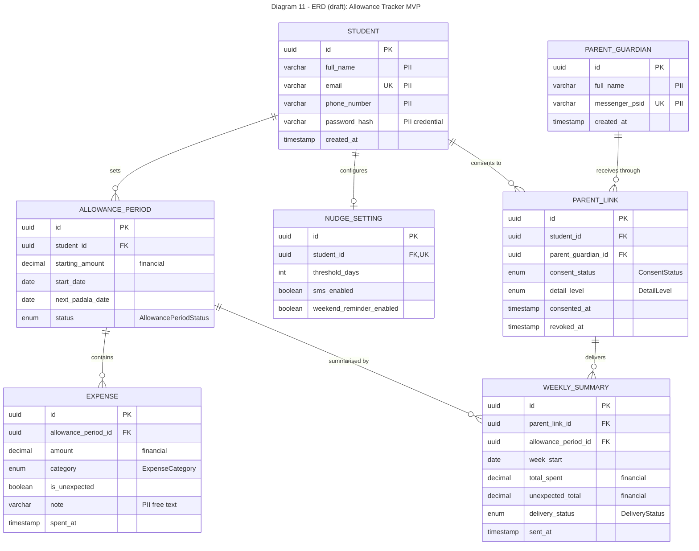

# Diagram 11: ERD (draft)

**Rules:** one table per stored class (7); enumerations are stored as enum columns; PII columns are marked `PII`; `NUDGE_SETTING.student_id` is unique to give the 0..1 multiplicity of Diagram 6.

**Primary audience:** Database developers and anyone handling personal data

**Risk it reduces:** Wrong keys or cardinalities, and unmarked personal data (PII) being exposed.

**Owner / reviewer (proposed):** Reese Goyal / Clarence B. Ginete
