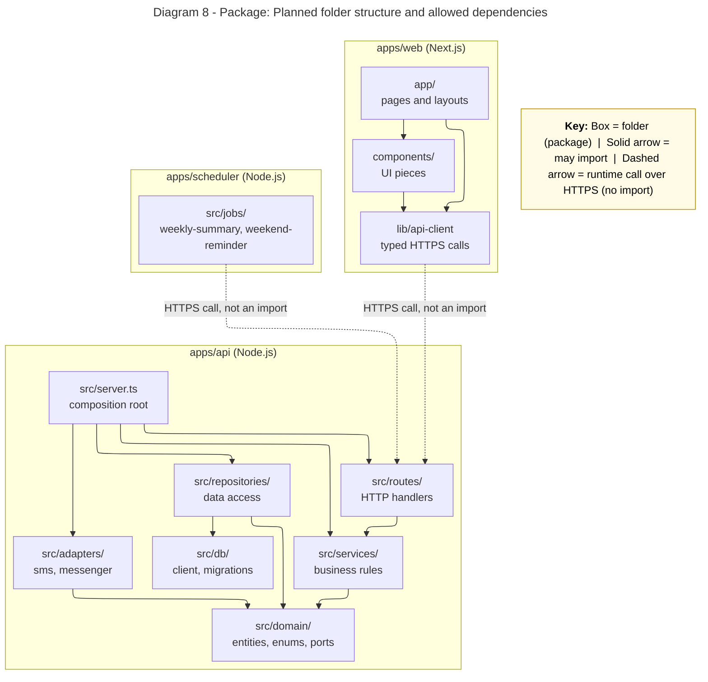

# Diagram 8: Package

**Layering rule:** Routes call services only, services depend on domain interfaces (ports) and never import adapters or the database client, and the web app and scheduler reach the API only over HTTPS, never by importing `apps/api` code.

```text
apps/
  web/        app/  components/  lib/api-client
  scheduler/  src/jobs/
  api/        src/server.ts  src/routes  src/services  src/repositories
              src/adapters   src/domain  src/db
docs/architecture/
```



**Primary audience:** Developers

**Risk it reduces:** Tangled imports that make the code hard to change or test.

**Owner / reviewer (proposed):** Shamel O. Rebusora / Clarence B. Ginete
