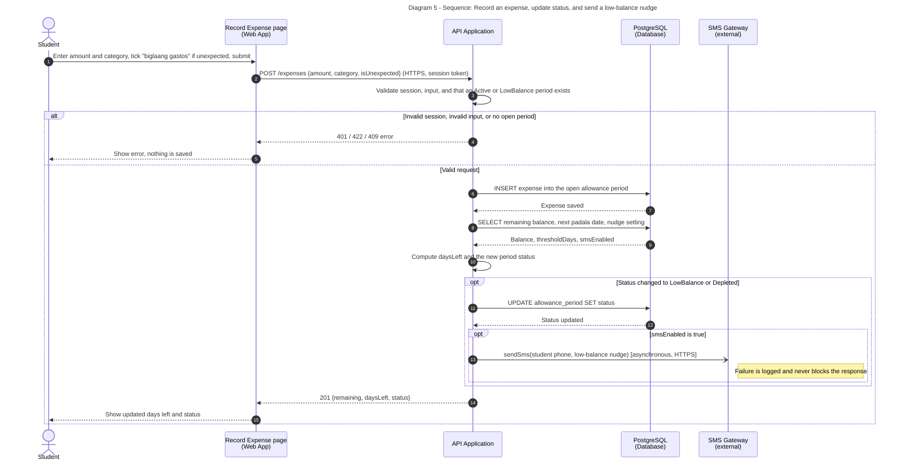

# Diagram 5: Sequence

**Why this flow:** it changes a status and calls an external system (SMS Gateway), and it depends on the riskiest assumption in our Javelin board (students logging expenses on the day they happen).

**Primary audience:** Front-end and back-end developers

**Risk it reduces:** Wrong balance or status after an expense, or an SMS failure that silently breaks saving.

**Owner / reviewer (proposed):** Shamel O. Rebusora / Reese Goyal
