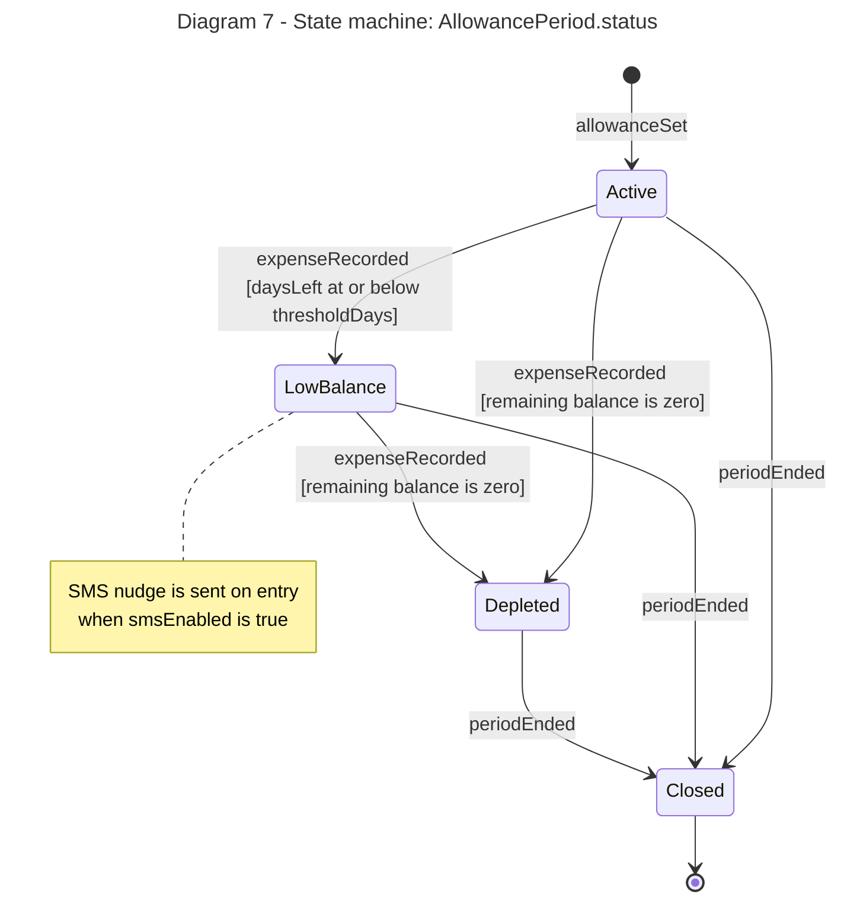

# Diagram 7: State machine

**Main entity:** `AllowancePeriod`. The four state names are copied exactly into the `AllowancePeriodStatus` enumeration of Diagram 6: Active, LowBalance, Depleted, Closed.

**Primary audience:** Developers and testers

**Risk it reduces:** Illegal status changes of an allowance period (e.g. reopening a Closed period).

**Owner / reviewer (proposed):** Clarence B. Ginete / Reese Goyal
