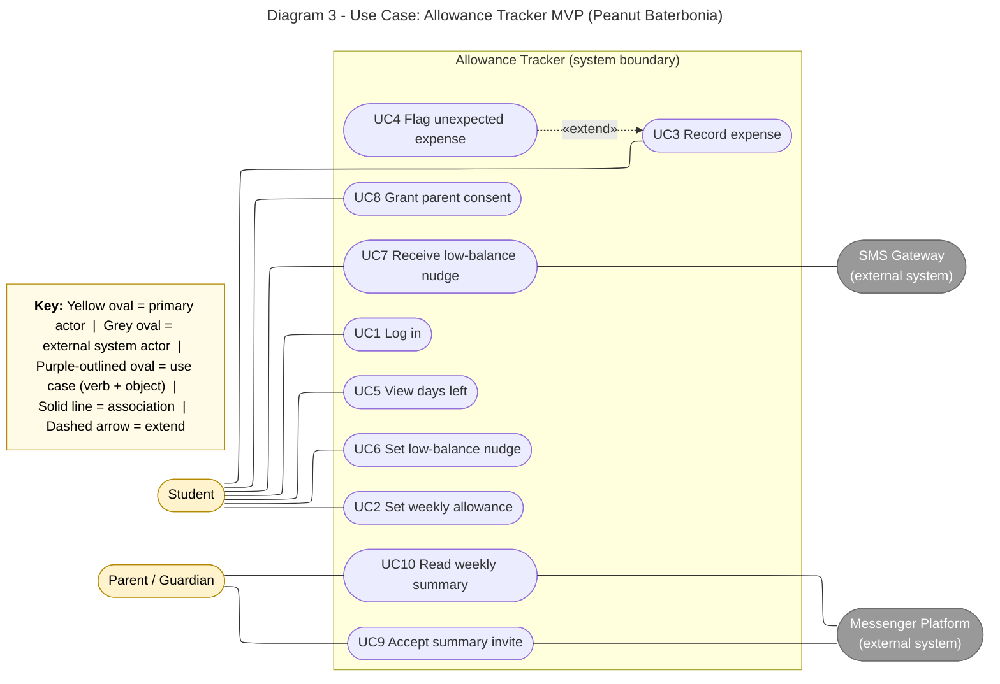

# Diagram 3: Use case

**Traceability to the MVP:** UC2 = log starting weekly allowance; UC3 + UC4 = quick flag for a *biglaang gastos*; UC5 + UC6 + UC7 = running "days left before the next padala" with a low-balance nudge; UC8 to UC10 = weekly summary for the parent (Experiment 2). UC1 supports all student goals.

**Primary audience:** Team and instructor (scope check)

**Risk it reduces:** Building features that are not in the validated MVP list (scope creep).

**Owner / reviewer (proposed):** Joram H. Hona / Erica G. Llena
